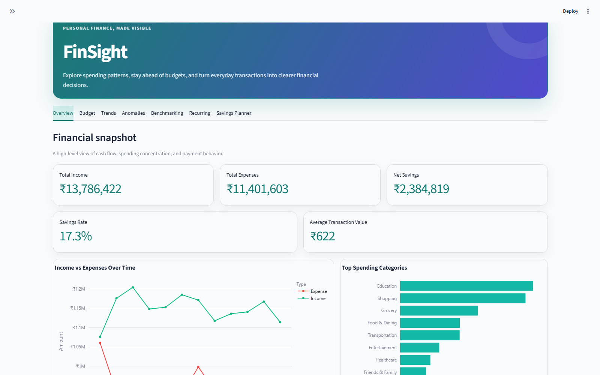
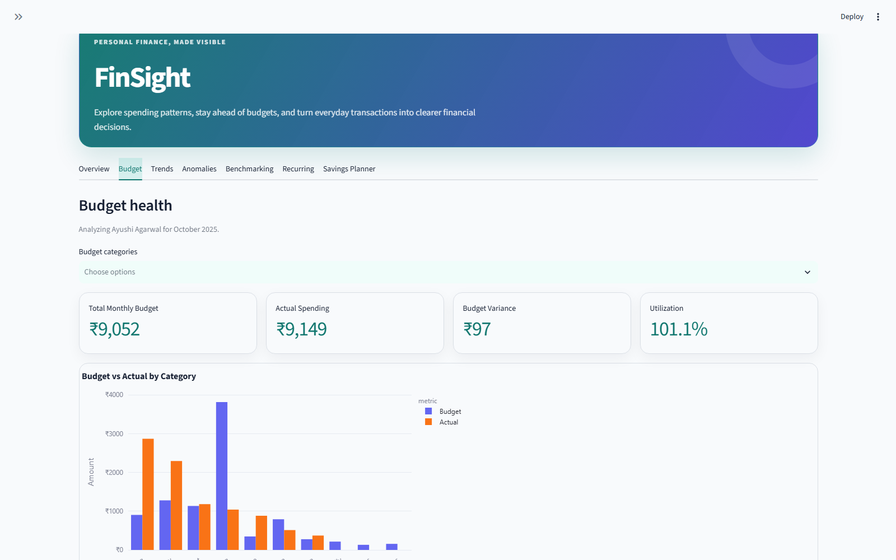
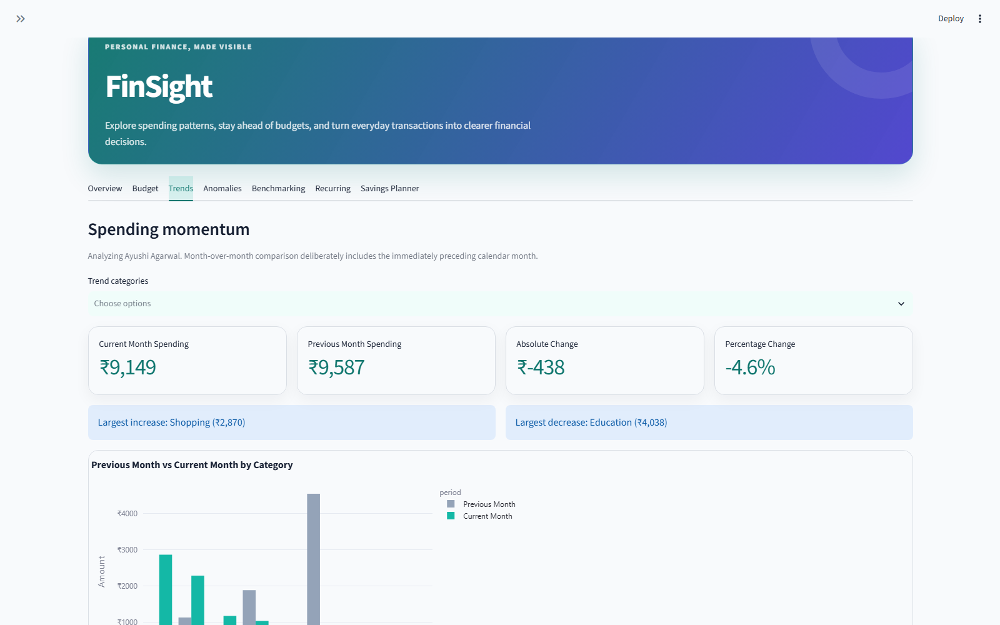
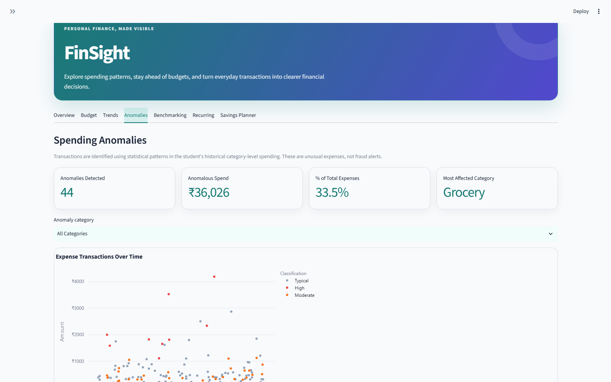
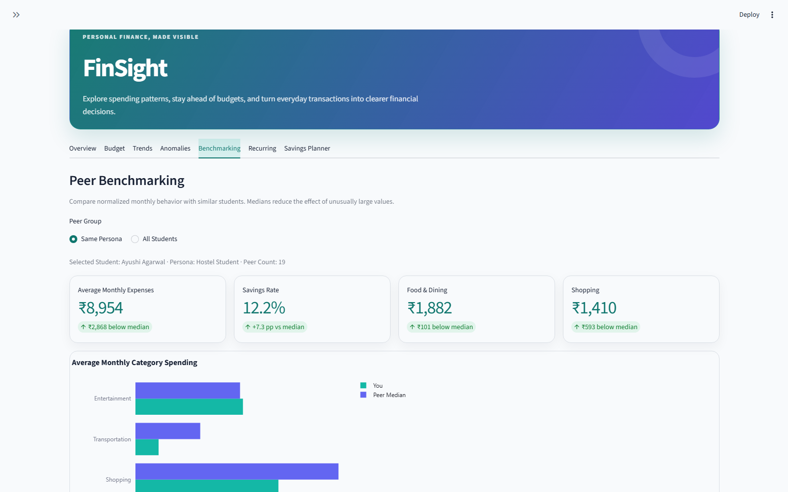
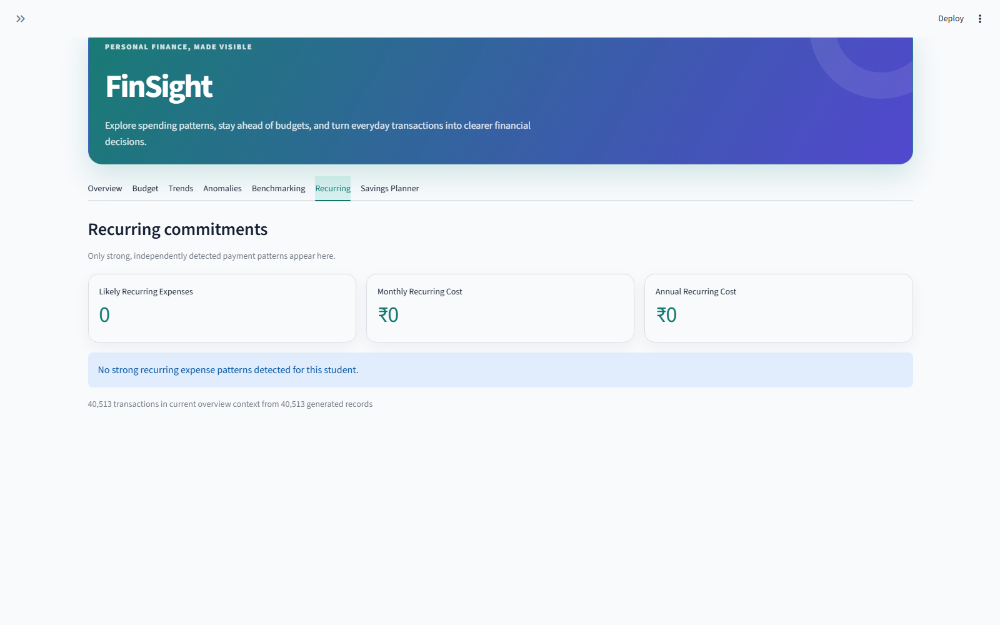
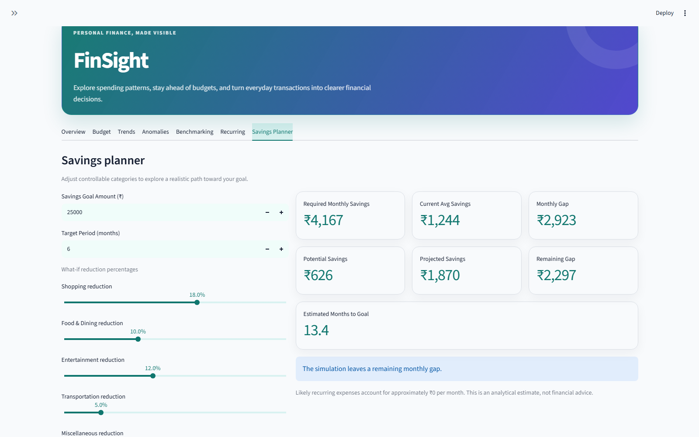

# FinSight

FinSight is a personal finance analytics project built around a realistic synthetic dataset for Indian college students. It demonstrates Python data generation, data engineering, MySQL schema design, financial analysis, and dashboard development.

## Problem Statement

Student financial behavior is useful to analyze, but real bank statements and payment histories contain sensitive personal information. FinSight solves this by generating synthetic transaction records that preserve believable spending patterns without exposing private financial data.

## Dataset Methodology

To understand the structure of transaction data, bank statement formats were studied to identify fields relevant for analytics. Based on those observations, FinSight uses a standardized schema and generates realistic synthetic records for student personas. The data is not collected from actual students.

Budgets are also synthetic. They represent planned monthly category allocations created independently from actual transaction amounts, using user income, persona, spending habit, category tendencies, and reproducible month-to-month variation. They are intended only for analytical budget-vs-actual comparison.

## Dataset Scope

- 100 synthetic Indian college students
- Transaction period: 2025-01-01 through 2025-12-31
- 40,234 generated transactions in the current seeded output
- 12,000 generated monthly category budget rows in the current seeded output
- Deterministic seeds for reproducible generation
- No investments, investment transactions, refunds, or refund category

## Personas

| Persona | Count | Expected behavior |
| --- | ---: | --- |
| Hostel Student | 20 | More food, grocery, and entertainment activity |
| Day Scholar | 20 | More transportation spending |
| Budget Student | 15 | Lower discretionary spending and frugal behavior |
| Tech Enthusiast | 10 | More technology, education, and entertainment spend |
| Fitness Enthusiast | 10 | More grocery and healthcare or wellness spend |
| Traveler | 10 | Higher transportation share |
| Shopaholic | 10 | Higher shopping share |
| Working Student | 5 | Higher probability of stipend and freelance income |

## Transaction Categories

Food & Dining, Grocery, Shopping, Entertainment, Recharge & Utilities, Education, Healthcare, Friends & Family, Income, Transportation, and Miscellaneous.

## Project Structure

    FinSight/
    ├── data/
    │   ├── raw/
    │   └── generated/
    │       ├── users.csv
    │       ├── transactions.csv
    │       └── budgets.csv
    ├── database/
    │   ├── schema.sql
    │   └── load_csv_to_mysql.py
    ├── src/
    │   ├── analytics/
    │   │   ├── anomalies.py
    │   │   ├── benchmarking.py
    │   │   └── insights.py
    │   ├── dashboard/
    │   │   └── app.py
    │   └── generator/
    │       ├── personas.py
    │       ├── merchant_library.py
    │       ├── generate_students.py
    │       ├── generate_transactions.py
    │       ├── generate_budgets.py
    │       └── utils.py
    ├── .env.example
    ├── .gitignore
    ├── requirements.txt
    └── README.md

## Technologies Used

- Python 3.13 compatible code
- pandas and NumPy for generation and analytics
- Faker for synthetic Indian user profiles
- Streamlit and Plotly for the dashboard
- MySQL schema and optional CSV loader
- python-dotenv for local database configuration

## Setup

    python -m venv .venv
    .venv\Scripts\activate
    pip install -r requirements.txt

On macOS/Linux, activate with source .venv/bin/activate.

## Generate the Dataset

Run from the project root:

    python src/generator/generate_students.py
    python src/generator/generate_transactions.py
    python src/generator/generate_budgets.py

The transaction generator validates the output and prints sanity statistics including transaction count, monthly distribution, persona distribution, category spending, and payment method distribution. The budget generator validates user IDs, category values, month values, positive amounts, and duplicate user/category/month/year rows.

## Dashboard Navigation

The Streamlit dashboard is organized into seven tabs:

- Overview: executive KPIs, core spending charts, and a compact Smart Insights panel
- Budget: monthly budget vs actual analysis
- Trends: month-over-month spending changes
- Anomalies: category-relative unusual-spending detection
- Benchmarking: same-persona peer comparisons and percentile context
- Recurring: deterministic recurring-expense detection
- Savings Planner: scenario-based savings goal simulation

Persona and student selection define the global analysis context. Month, category, and goal inputs are scoped to the specific analytical tabs where they apply.
## Run the Dashboard

    streamlit run src/dashboard/app.py

The dashboard reads the generated CSV files directly, so MySQL is not required for visualization.

## Screenshots

| Overview | Budget |
| --- | --- |
|  |  |

| Trends | Anomalies |
| --- | --- |
|  |  |

| Benchmarking | Recurring |
| --- | --- |
|  |  |

| Savings Planner |
| --- |
|  |

## MySQL Setup

Create a local .env file from .env.example and configure credentials:

    MYSQL_HOST=localhost
    MYSQL_PORT=3306
    MYSQL_USER=root
    MYSQL_PASSWORD=your_password
    MYSQL_DATABASE=finsight

Then run:

    python database/load_csv_to_mysql.py

The loader executes database/schema.sql and imports users.csv, transactions.csv, and budgets.csv. Passwords in the synthetic users file are generator placeholders only and are not an example of production authentication security.

## Analytics Features

- Total income, expenses, net savings, and savings rate
- Monthly income and expense trends
- Spending by category
- Top merchants
- Payment method distribution
- Persona-based spending comparison
- Weekend versus weekday spending
- Spending habit comparisons
- Discretionary versus essential spend grouping
- Budget vs Actual Analysis by monthly category budget
- Month-over-Month Spending Analysis against the immediately preceding calendar month
- Rule-Based Smart Insights generated from deterministic analytical rules, not an LLM/API
- Spending Anomaly Detection using explainable category-level IQR thresholds
- Persona / Peer Benchmarking using monthly normalization, cohort medians, and percentile ranks
- Recurring Expense Detection using repeat-merchant behavior, amount consistency, month coverage, and interval checks
- Savings Goal Simulator using historical income, expense, discretionary spending, and recurring-cost estimates

## Budget vs Actual Analysis

Budget analysis compares planned category allocations with actual expenses for a selected student and month. Variance uses this convention:

    variance = actual expense - budget

Positive variance means overspending, and negative variance means spending under budget. Utilization is calculated as actual divided by budget. Status labels are analytical classifications only: Within Budget, Near Limit, and Over Budget.

## Month-over-Month Analysis

MoM analysis compares a selected student/month against the immediately preceding calendar month. January correctly looks for December of the prior year. If previous spending is zero, the dashboard avoids infinite percentages and labels new category spending explicitly.

## Rule-Based Smart Insights

Smart Insights are deterministic, data-derived statements ranked by usefulness. They cover significant budget deviations, meaningful month-over-month category changes, savings-rate shifts when income is available, dominant categories, and merchant concentration. The dashboard keeps this section compact by showing the highest-priority insights first and placing additional insights behind an expander. No OpenAI API, LLM, random text, or hardcoded conclusions are used.

## Spending Anomaly Detection

FinSight detects unusually large expenses relative to each student's own historical behavior within the same category. For a category with at least 10 expense transactions, it calculates Q1, Q3, and the interquartile range (IQR), then uses an upper fence of `Q3 + 2.0 × IQR`. Categories with insufficient history or zero IQR are skipped rather than compared against a statistically weak fallback.

Severity remains explainable: an anomaly is High only when it exceeds the upper fence by at least ₹1,000 and is at least three times the category median; otherwise it is Moderate. These results identify statistical spending outliers, not fraud, suspicious activity, or fraudulent transactions.

## Persona / Peer Benchmarking

Peer Benchmarking compares a selected student with other students in the same persona by default, excluding the selected student from their own cohort. An optional all-student view is also available. Income, expenses, net savings, category spend, and transaction frequency are normalized to monthly averages across each student's observed history. Savings rate uses the same `(income - expenses) / income` definition as the rest of FinSight.

The cohort median is the primary benchmark because financial amounts can be skewed. Percentiles use a midrank calculation, which treats tied values fairly. Rankings are descriptive: a higher spending percentile is not presented as better or worse.

## Recurring Expense Detection

Recurring expenses are detected analytically from expense transaction behavior for each selected student. The detector looks for merchants that appear across at least four distinct months, have reasonably consistent amounts, mostly occur no more than once per active month, and show monthly-like timing or broad month coverage. It uses coefficient of variation and maximum deviation from the median amount to avoid treating frequent variable spending as a subscription-like pattern.

The dashboard reports likely recurring merchants, estimated monthly cost, annualized cost, occurrence counts, distinct months, amount variability, interval consistency, and a simple High or Medium confidence label. Income transactions are excluded.

## Savings Goal Simulator

The Savings Planner is a scenario-based educational analytics tool, not professional financial advice. It calculates required monthly savings from a goal and target period, compares that requirement with historical average monthly savings, and estimates a savings gap.

When a gap exists, the simulator analyzes actual historical category spending and suggests conservative reductions in controllable categories such as Shopping, Entertainment, Food & Dining, Miscellaneous, and limited Transportation. Users can adjust the proposed reduction percentages to run what-if scenarios. The output estimates potential monthly savings, projected monthly savings, remaining gap, and estimated months to goal when mathematically valid.
## Privacy Rationale

Financial transaction data is sensitive. FinSight uses synthetic records so portfolio analysis and dashboard development can be demonstrated without exposing private bank statements or personal financial histories.

